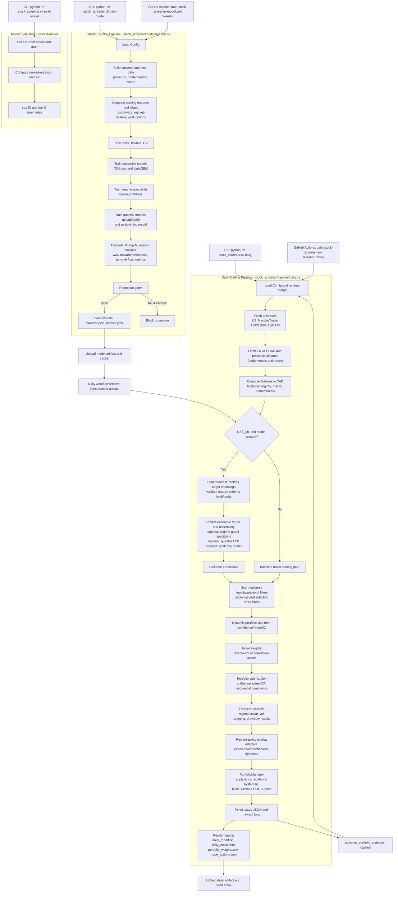

# Stock Screener (CAD) + Short-Horizon Trading (max 5 days)

This repo runs a daily **US + TSX/TSXV** stock screener, recommends a portfolio, and produces explicit **BUY/SELL/HOLD** actions with a **max holding period of 5 days**. It also trains a single ML ranking model weekly (Sunday 02:00 UTC).

### What you get each day

- **Email** with:
  - recommended actions (BUY/SELL/HOLD)
  - portfolio weights (CAD)
  - a full text report + machine-readable `trade_actions.json`

### Local run

Install deps:

```bash
pip install -r requirements.txt
```

Train model (optional; the daily run falls back if no model is present):

```bash
LABEL_HORIZON_DAYS=5 python -m stock_screener.cli train-model --log-level INFO
```

Run daily trading pipeline:

```bash
MAX_HOLDING_DAYS=5 PORTFOLIO_STATE_PATH=screener_portfolio_state.json python -m stock_screener.cli daily --log-level INFO
```

Outputs:

- `reports/daily_email.html`
- `reports/daily_report.txt`
- `reports/portfolio_weights.csv`
- `reports/trade_actions.json`

### GitHub Actions

See `docs/GITHUB_WORKFLOWS.md` for workflow schedules, runtime-budget settings, and required secrets.

### End-to-End Workflow Diagram


